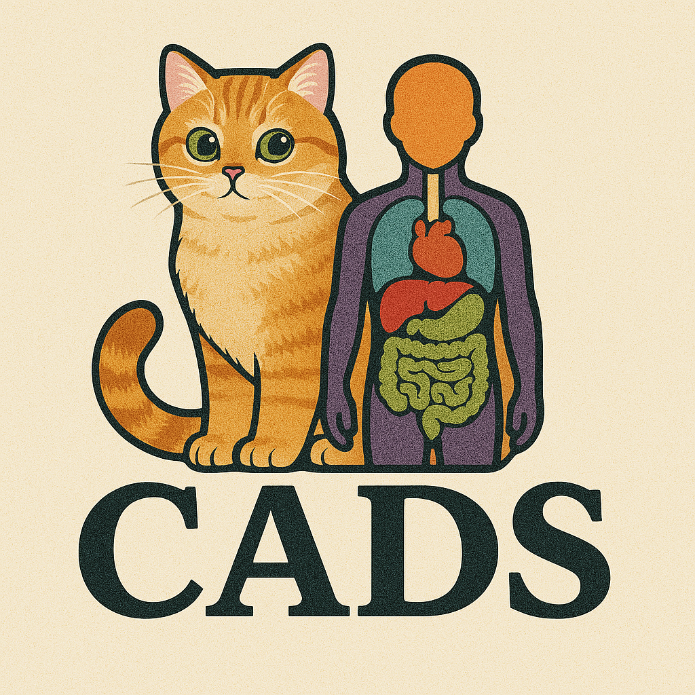
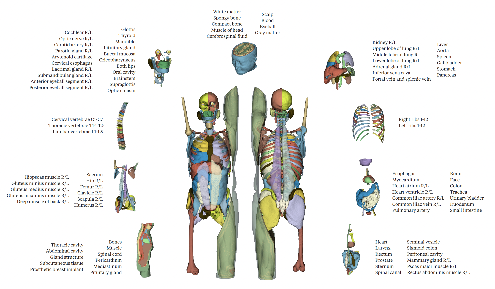

# CADS : A Comprehensive Anatomical Dataset and Segmentation for Whole-Body Anatomy in Computed Tomography

## News
- [July 2024] Updated model weights and paper preprint, please refer to the [Useful Links](#useful-links) section below!
- [March 2025] Model weights and paper preprint coming soon!

## Table of Contents
1. [Overview](#overview)
2. [Useful Links](#useful-links)
3. [Installation](#installation)
4. [Quick Start](#quick-start)
5. [Target Structures in Each Task](#target-structures-in-each-task)
6. [Citation](#citation)

## Overview


CADS is a robust, fully automated framework for segmenting 167 anatomical structures in Computed Tomography (CT), spanning from head to knee regions across diverse anatomical systems.

The framework consists of two main components:

1. **CADS-dataset**: 
   - 22,022 CT volumes with complete annotations for 167 anatomical structures.
   - Most extensive whole-body CT dataset, exceeding current collections in both scale (18x more CT scans) and anatomical coverage (60% more distinct targets).
   - Data collected from publicly available datasets and private hospital data, spanning 100+ imaging centers across 16 countries.
   - Diverse coverage of clinical variability, protocols, and pathological conditions.
   - Built through an automated pipeline with pseudo-labeling and unsupervised quality control.

2. **CADS-model**: 
   - An open-source model suite for automated whole-body segmentation.
   - Performance validated on both public challenges and real-world hospital cohorts.
   - Available as Python script run (this GitHub repo) for flexible command-line usage.
   - Also available as a user-friendly 3D Slicer plugin with UI interface, simple installation and one-click inference.

## Useful Links
- [📄 CADS Paper Preprint](https://arxiv.org/abs/2507.22953)
- [🤗 CADS-dataset](https://huggingface.co/datasets/mrmrx/CADS-dataset)
- [📦 CADS-model Weights](https://github.com/murong-xu/CADS/releases/tag/cads-model_v1.0.0)
- [🔧 CADS-model Codebase](https://github.com/murong-xu/CADS)
- [🛠 CADS-model 3D Slicer Plugin](https://github.com/murong-xu/SlicerCADSWholeBodyCTSeg)

## Installation

Below we provide instructions for Python script run. For 3D Slicer plugin installation, please refer to [SlicerCADSWholeBodyCTSeg](https://github.com/murong-xu/SlicerCADSWholeBodyCTSeg).

```bash
# 1. Clone the repository
git clone git@github.com:murong-xu/CADS.git
# or download from https://github.com/murong-xu/CADS

# 2. Create and activate conda environment (Python>=3.9 required)
conda create -n CADS_env python=3.11
conda activate CADS_env

# 3. Install PyTorch
# Visit https://pytorch.org/ and select the appropriate version based on your Operating System and CUDA version
# Browse previous releases here if you prefer not to install the latest version: https://pytorch.org/get-started/previous-versions/
# CADS requirement: torch>=2.1.2
# Example installation command for Linux with CUDA 12.4:
pip install torch==2.5.1 torchvision==0.20.1 torchaudio==2.5.1 --index-url https://download.pytorch.org/whl/cu124

# 4. Install CADS
cd CADS  # the cloned git repo
pip install -e .

# Note: During installation, you may see warnings about "DEPRECATION: Legacy editable install".
# This warning is expected and can be safely ignored - it doesn't affect the functionality of CADS.
```

## Quick Start
Example script for running inference:

```bash
python cads/scripts/predict_images.py \
    -in "/path/to/ct_images" \    # Input directory containing CT images (.nii.gz format)
    -out "/path/to/output" \      # Output directory for segmentation results
    -task "all"                   # Task ID options:
                                  #   - "all": run all tasks
                                  #   - single task: choose from 551-559
                                  #   (see "Target Structures in Each Task" section below)
```

## Target Structures in Each Task
Each task ID (model 551-559) represents a specific anatomical group. For detailed indexing please refer to [model labelmap](resources/info/labelmap.md).

**Task 551: Major abdominal organs, primary thoracic organs (lungs), and major abdominal vasculature**
Spleen, Kidney R/L, Gallbladder, Liver, Stomach, Aorta, Inferior vena cava, Portal and splenic veins, Pancreas, Adrenal glands R/L, Upper/Lower lobes of left lung, Upper/Middle/Lower lobes of right lung.

**Task 552: Complete set of individual vertebrae from cervical to lumbar regions**
Vertebrae C1-C7, T1-T12, L1-L5.

**Task 553: Various thoracic and abdominal organs, brain, major pelvic vessels, and face**
Esophagus, Trachea, Myocardium, Heart atrium R/L, Heart ventricle R/L, Pulmonary artery, Brain, Common iliac artery R/L, Common iliac vein R/L, Small intestine, Duodenum, Colon, Urinary bladder, Face.

**Task 554: Major bones of the appendicular skeleton, sacrum, and associated large muscle groups**
Humerus R/L, Scapula R/L, Clavicle R/L, Femur R/L, Hip R/L, Sacrum, Gluteus maximus/medius/minimus muscles R/L, Deep muscle of back R/L, Iliopsoas muscle R/L.

**Task 555: Complete set of individual ribs, both left and right**
Ribs 1-12 R/L.

**Task 556: Miscellaneous structures for radiation therapy**
Spinal canal, Larynx, Heart, Colostomy bag, Sigmoid colon, Rectum, Prostate, Seminal vesicle, Mammary gland R/L, Sternum, Psoas major muscle R/L, Rectus abdominis muscle R/L.

**Task 557: Brain and head tissues**
White matter, Gray matter, Cerebrospinal fluid, Scalp, Eyeballs, Compact bone, Spongy bone, Blood, Muscle of head.

**Task 558: Head and neck structures**
Carotid artery R/L, Arytenoid cartilage, Mandible, Brainstem, Buccal mucosa, Oral cavity, Cochlear R/L, Cricopharyngeus, Cervical esophagus, Anterior/Posterior eyeball segment R/L, Lacrimal gland R/L, Submandibular gland R/L, Thyroid, Glottis, Supraglottis, Both lips, Optic chiasm, Optic nerve R/L, Parotid gland R/L, Pituitary gland.

**Task 559: General tissue types, major body cavities, broad anatomical categories**
Subcutaneous tissue, Muscle, Abdominal cavity, Thoracic cavity, Bones, Gland structure, Pericardium, Prosthetic breast implant, Mediastinum, Spinal cord.

## License

- **Codebase** (the `cads` package and all source code in this repository) is licensed under the [Apache License 2.0](LICENSE).  
- **Model weights** released in the [Releases](https://github.com/murong-xu/CADS/releases) section are licensed under [CC BY 4.0](MODEL_LICENSE).  

## Citation
If you find this work useful, please cite:

```bibtex
@article{xu2025cads,
  title={CADS: A Comprehensive Anatomical Dataset and Segmentation for Whole-Body Anatomy in Computed Tomography},
  author={Xu, Murong and Amiranashvili, Tamaz and Navarro, Fernando and Fritsak, Maksym and Hamamci, Ibrahim Ethem and Shit, Suprosanna and Wittmann, Bastian and Er, Sezgin and Christ, Sebastian M. and de la Rosa, Ezequiel and Deseoe, Julian and Graf, Robert and Möller, Hendrik and Sekuboyina, Anjany and Peeken, Jan C. and Becker, Sven and Baldini, Giulia and Haubold, Johannes and Nensa, Felix and Hosch, René and Mirajkar, Nikhil and Khalid, Saad and Zachow, Stefan and Weber, Marc-André and Langs, Georg and Wasserthal, Jakob and Ozdemir, Mehmet Kemal and Fedorov, Andrey and Kikinis, Ron and Tanadini-Lang, Stephanie and Kirschke, Jan S. and Combs, Stephanie E. and Menze, Bjoern},
  journal={arXiv preprint arXiv:2507.22953},
  year={2025}
}
```