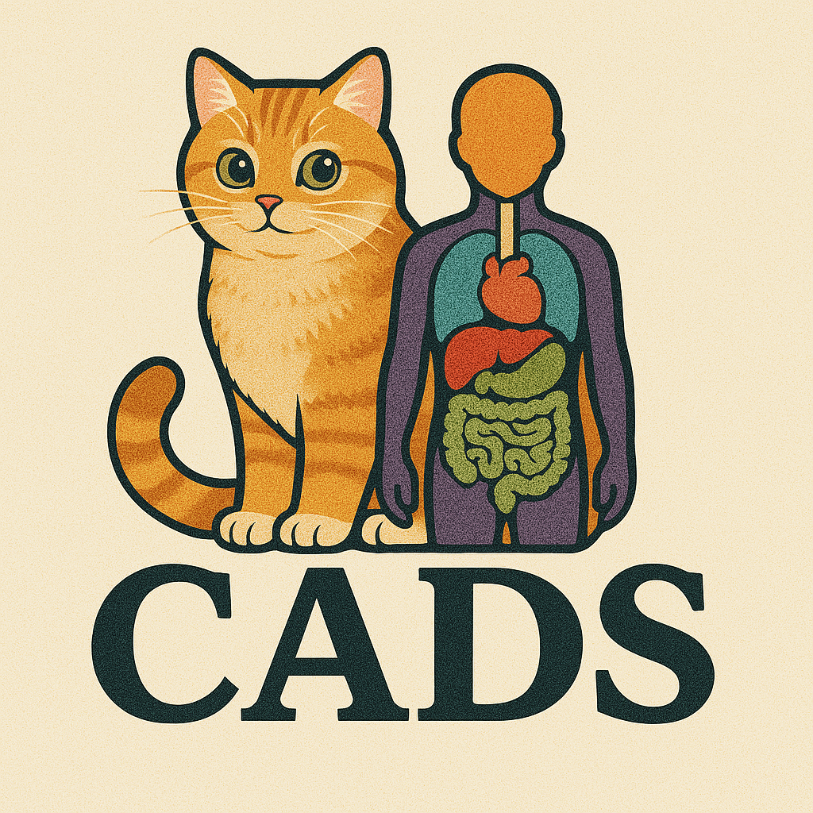

# CADS : A Comprehensive Anatomical Dataset and Segmentation for Whole-Body Anatomy in Computed Tomography

## News
- [July 2026] New model variants are now available! We've introduced licensing-stratified options to provide more flexibility for different use cases. For more details, please see the [Model Variants](#model-variants) section.
- [July 2026] Updated model weights and paper preprint, please refer to the [Useful Links](#useful-links) section below!
- [March 2025] Model weights and paper preprint coming soon!

## Table of Contents
1. [Overview](#overview)
2. [Useful Links](#useful-links)
3. [Installation](#installation)
4. [Model Variants](#model-variants)
5. [Option 1: Quick Start](#option-1--quick-start-run-everything-in-one-command)
6. [Option 2: Staged Pipeline](#option-2--staged-pipeline-recommended-for-large-scale-processing)
7. [Target Structures in Each Task](#target-structures-in-each-task)
8. [Other Resources for Download](#other-resources-for-download)
9. [License](#license)
10. [Citation](#citation)

## Overview


CADS is a robust, fully automated framework for segmenting 167 anatomical structures in Computed Tomography (CT), spanning from head to knee regions across diverse anatomical systems.

The framework consists of two main components:

1. **CADS-dataset**:
   - 22,022 CT volumes with complete annotations for 167 anatomical structures.
   - Most extensive whole-body CT dataset, exceeding current collections in both scale (18x more CT scans) and anatomical coverage (60% more distinct targets).
   - Data collected from publicly available datasets and private hospital data, spanning 100+ imaging centers across 16 countries.
   - Diverse coverage of clinical variability, protocols, and pathological conditions.
   - Built through an automated pipeline with pseudo-labeling and unsupervised quality control.

2. **CADS-model**:
   - An open-source model suite for automated whole-body segmentation.
   - Performance validated on both public challenges and real-world hospital cohorts.
   - Available as Python script run (this GitHub repo) for flexible command-line usage.
   - Also available as a user-friendly 3D Slicer plugin with UI interface, simple installation and one-click inference.

## Useful Links
- [📄 CADS Paper Preprint](https://arxiv.org/abs/2507.22953)
- [🤗 CADS-dataset](https://huggingface.co/datasets/mrmrx/CADS-dataset)
- [📦 CADS-model Weights](https://github.com/murong-xu/CADS/releases)
- [🔧 CADS-model Codebase](https://github.com/murong-xu/CADS)
- [🛠 CADS-model 3D Slicer Plugin](https://github.com/murong-xu/SlicerCADSWholeBodyCTSeg)

## Installation

Below we provide instructions for Python script run. For 3D Slicer plugin installation, please refer to [SlicerCADSWholeBodyCTSeg](https://github.com/murong-xu/SlicerCADSWholeBodyCTSeg).

```bash
# 1. Clone the repository
git clone git@github.com:murong-xu/CADS.git
# or download from https://github.com/murong-xu/CADS

# 2. Create and activate conda environment (Python>=3.9 required)
conda create -n CADS_env python=3.11
conda activate CADS_env

# 3. Install PyTorch
# Visit https://pytorch.org/ and select the appropriate version based on your Operating System and CUDA version
# Browse previous releases here if you prefer not to install the latest version: https://pytorch.org/get-started/previous-versions/
# CADS requirement: torch>=2.1.2
# Example installation command for Linux with CUDA 12.4:
pip install torch==2.5.1 torchvision==0.20.1 torchaudio==2.5.1 --index-url https://download.pytorch.org/whl/cu124

# 4. Install CADS
cd CADS  # the cloned git repo
pip install -e .

# Note: During installation, you may see warnings about "DEPRECATION: Legacy editable install".
# This warning is expected and can be safely ignored - it doesn't affect the functionality of CADS.
```

## Model Variants

CADS provides three pretrained model-weight variants. They use the same architecture, task grouping, and 167 target structures, but differ in the licensed training data sources.

- **`reference`**: CADS customized model license. Intended for reproducing the reference CADS-model and manuscript results, or for users who specifically need the model trained on the full CADS data-source collection.
- **`research`**: CC BY-NC-SA 4.0. Recommended for most academic and non-commercial research use, with performance nearly identical to the reference model in the reported evaluation.
- **`open`**: CC BY-SA 4.0. Intended for users who need a model-weight license permitting redistribution of derived weights, including commercial use, under share-alike terms. Performance may be degraded for some detailed head-and-neck structures.

For details about the licensing terms and model differences, see [cads/LICENSE_MODEL](cads/LICENSE_MODEL) and the [CADS model releases](https://github.com/murong-xu/CADS/releases).


## Option 1 — Quick Start (Run everything in one command)
Example script for running inference:

```bash
python cads/scripts/predict_images.py \
    -in "/path/to/ct_images" \
    -out "/path/to/output" \
    -task all \
    -license research
```

`-task` can be `all` or a single task ID from 551-559. 

`-license` can be `reference`, `research`, or `open`; if omitted, the default is `reference`. 

Add `--cpu` to run without GPU acceleration.


## Option 2 — Staged Pipeline (Recommended for large-scale processing)
For large-scale processing of CT volumes (e.g., ~100–1000 scans or more), which can require more processing time, the full pipeline can be split into **standalone** stages to better utilize computational resources: **CPU** for CT preprocessing and segmentation restoration, and **GPU** for model inference. Intermediate outputs are saved to disk for use in subsequent stages.
1. **Preprocess CT (CPU-only)** — `cads/scripts/run_01_preprocess.py`
   Reads raw CT NIfTI files, performs reorientation and resampling, and writes preprocessed images along with a small *_metadata.pkl file per case (required later for restoration).
   ```bash
   python cads/scripts/run_01_preprocess.py \
    -in "/path/to/raw_ct_images" \  # Directory of raw CT nifti images
    -out_preprocessed_img "/path/to/preprocessed" \  # Output directory for preprocessed images
    -out_metadata "/path/to/metadata" \  # Output directory for image metadata
    ```
2. **Inference (GPU recommended)** — `cads/scripts/run_02_inference.py`
   Runs the CADS-model on **preprocessed** NIfTIs only. Set `-task` to `all` or a single id from 551–559. Outputs one folder per case with `_part_551`…`_part_559` segmentations in **preprocessed** space. Add `--cpu` if no GPU is available.
   ```bash
   python cads/scripts/run_02_inference.py \
    -in_preprocessed_images "/path/to/preprocessed" \
    -out "/path/to/seg_in_preprocessed_space" \
    -task all \
    -license research
   ```
   `-license` is optional and defaults to `reference`. 
   
   Add `--cpu` to run without GPU acceleration.
3. **Restore segmentation to original image format (CPU-only)** — `cads/scripts/run_03_restore_seg.py`
   Uses the inference outputs (from step 2) and image metadata (from step 1) to restore segmentations to the **original** image geometry.
   ```bash
   python cads/scripts/run_03_restore_seg.py \
    -in_seg "/path/to/seg_in_preprocessed_space" \
    -in_metadata "/path/to/metadata" \
    -out_seg "/path/to/seg_in_original_space" \  # Output segmentation masks in original image geometry
   ```

## Target Structures in Each Task
Each task ID (model 551-559) represents a specific anatomical group. For detailed indexing please refer to [model labelmap](resources/info/labelmap.md).

**Task 551: Major abdominal organs, primary thoracic organs (lungs), and major abdominal vasculature**
Spleen, Kidney R/L, Gallbladder, Liver, Stomach, Aorta, Inferior vena cava, Portal and splenic vein, Pancreas, Adrenal gland R/L, Upper/Lower lobe of left lung, Upper/Middle/Lower lobe of right lung.

**Task 552: Complete set of individual vertebrae from cervical to lumbar regions**
Vertebrae C1-C7, T1-T12, L1-L5.

**Task 553: Various thoracic and abdominal organs, brain, major pelvic vessels, and face**
Esophagus, Trachea, Myocardium, Heart atrium R/L, Heart ventricle R/L, Pulmonary artery, Brain, Common iliac artery R/L, Common iliac vein R/L, Small intestine, Duodenum, Colon, Urinary bladder, Face.

**Task 554: Major bones of the appendicular skeleton, sacrum, and associated large muscle groups**
Humerus R/L, Scapula R/L, Clavicle R/L, Femur R/L, Hip stucture R/L, Bone structure of sacrum, Gluteus maximus/medius/minimus muscles R/L, Deep muscle of back R/L, Iliopsoas muscle R/L.

**Task 555: Complete set of individual ribs, both left and right**
Ribs 1-12 R/L.

**Task 556: Miscellaneous structures for radiation therapy**
Spinal canal, Larynx, Heart, Bowel space, Sigmoid colon, Rectum, Prostate, Seminal vesicle, Mammary gland R/L, Sternum, Psoas major muscle R/L, Rectus abdominis muscle R/L.

**Task 557: Brain and head tissues**
White matter, Gray matter, Cerebrospinal fluid, Scalp, Eyeballs, Compact bone, Spongy bone, Vascular structure of head, Rectus eye muscle structure.

**Task 558: Head and neck structures**
Carotid artery R/L, Arytenoid cartilage, Mandible, Brain stem, Buccal mucosa, Oral cavity, Cochlea R/L, Cricopharyngeus, Cervical esophagus, Anterior/Posterior eyeball segment R/L, Lacrimal gland R/L, Submandibular gland R/L, Thyroid, Glottis, Supraglottis, Lip, Optic chiasm, Optic nerve R/L, Parotid gland R/L, Pituitary gland.

**Task 559: General tissue types, major body cavities, broad anatomical categories**
Subcutaneous tissue, Muscle, Abdominopelvic cavity, Thoracic cavity, Bone structure, Gland structure, Pericardium, Breast implant, Mediastinum, Spinal cord.

## Other Resources for Download

Additional resources released with the CADS manuscript are available here:

- **Expert Review and Corrected Label Subset on TotalSegmentator Data**: Radiologist review records for the 65 held-out TotalSegmentator test cases used in the CADS study, together with manually corrected labels used for the corrected mini-benchmark. [[Download]](https://drive.switch.ch/index.php/s/pc9mJaYLzoYSfwe)

## License

- **Codebase** (the `cads` package and all source code in this repository) is licensed under the [Apache License 2.0](LICENSE).
- **Model weights** are released in three variants: `reference` under the CADS customized model license, `research` under CC BY-NC-SA 4.0, and `open` under CC BY-SA 4.0. See [cads/LICENSE_MODEL](cads/LICENSE_MODEL) for details.

## Citation
If you use any component of CADS (CADS-dataset, its curated segmentation masks, pretrained CADS-model, or the 3D Slicer extension), please cite:

```bibtex
@article{xu2025cads,
  title={CADS: A Comprehensive Anatomical Dataset and Segmentation for Whole-Body Anatomy in Computed Tomography},
  author={Xu, Murong and Amiranashvili, Tamaz and Navarro, Fernando and Fritsak, Maksym and Hamamci, Ibrahim Ethem and Shit, Suprosanna and Wittmann, Bastian and Er, Sezgin and Christ, Sebastian M. and de la Rosa, Ezequiel and Deseoe, Julian and Graf, Robert and Möller, Hendrik and Sekuboyina, Anjany and Peeken, Jan C. and Becker, Sven and Baldini, Giulia and Haubold, Johannes and Nensa, Felix and Hosch, René and Mirajkar, Nikhil and Khalid, Saad and Zachow, Stefan and Weber, Marc-André and Langs, Georg and Wasserthal, Jakob and Ozdemir, Mehmet Kemal and Fedorov, Andrey and Kikinis, Ron and Tanadini-Lang, Stephanie and Kirschke, Jan S. and Combs, Stephanie E. and Menze, Bjoern},
  journal={arXiv preprint arXiv:2507.22953},
  year={2025}
}
```