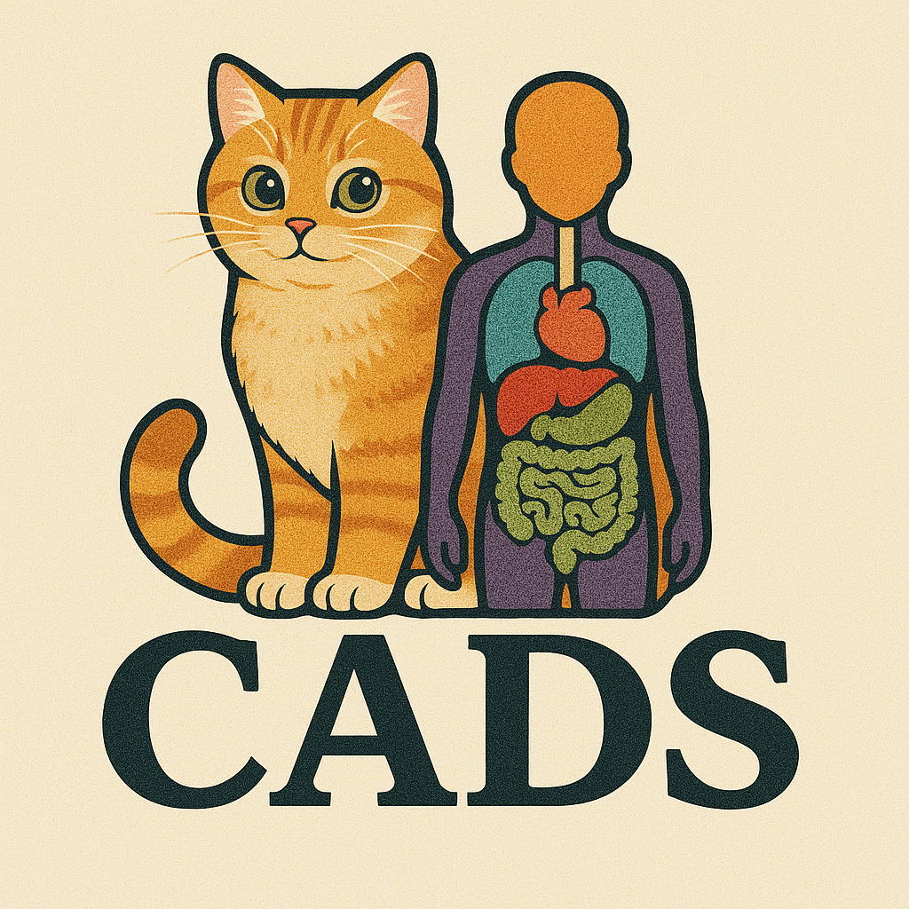

# CADS: Comprehensive Anatomical Dataset and Segmentation for Whole-body CT

## News
- [March 2025] Model weights and paper preprint coming soon!

## Table of Contents
1. [Overview](#overview)
2. [Installation](#installation)
3. [Quick Start](#quick-start)
3. [Citation](#citation)

## Overview


CADS is an open-source project for comprehensive whole-body CT segmentation, consisting of two main components:

1. **Large-scale label set**: 
   - Annotations for 22,022 CT volumes collected from publicly available datasets and private hospital data, spanning 100+ imaging centers across 16 countries
   - 167 anatomical structures covering major body regions
   - Built through an innovative automatic pipeline with pseudo-labeling and unsupervised quality control

2. **Automatic segmentation models**: 
   - A family of open-source deep learning models for automatic whole-body segmentation
   - Trained on our diverse CT collection
   - Extensively validated on both public challenges and real-world hospital data

This project aims to provide the medical imaging community with both a diverse dataset and robust, generalizable, ready-to-use segmentation models that aim to improve AI in clinical standards.


**Useful Links**
- [📄 Paper] Coming soon ...

## Installation
```bash
# 1. Clone the repository
git clone git@github.com:murong-xu/CADS.git
# or download from https://github.com/murong-xu/CADS

# 2. Create and activate conda environment
conda create -n CADS_env python=3.11
conda activate CADS_env

# 3. Install PyTorch
# Visit https://pytorch.org/ for the correct installation command for your system

# 4. Install CADS
cd CADS
pip install -e .
```

## Quick Start
Example script for running inference using the `predict()` function:

```python
python cads/scripts/predict_images.py \
    -in "/path/to/ct_images" \  # Directory containing .nii.gz CT files
    -out "/path/to/output" \    # Output directory
    -model "/path/to/models" \  # Directory containing model weights
    --preprocessing \           # Enable preprocessing (keep this flag)
    --postprocessing \         # Enable postprocessing (keep this flag)
    -task "551" \              # Model task ID (551-559, or 'all')
    -np 4 \                    # Number of preprocessing threads
    -ns 6                      # Number of threads for saving files
```


## Citation
If you find this work useful, please cite:
```bibtex
@techreport{xu2025cads,
    author = {Xu, Murong and Amiranashvili, Tamaz and Navarro, Fernando and Menze, Bjoern H},
    title = {CADS: Comprehensive Anatomical Dataset and Segmentation for Whole-body CT},
    institution = {Department of Quantitative Biomedicine, University of Zurich},
    year = {2025},
    url = {https://github.com/murong-xu/CADS},
    type = {Technical Report}
}
```